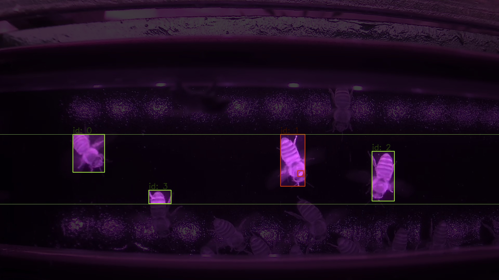

# SemiCode

***
## Table of Contents
- [SemiCode](#semicode)
  - [Table of Contents](#table-of-contents)
  - [Allgemeine Informationen](#allgemeine-informationen)
  - [Technologien](#technologien)
  - [Installation](#installation)
  - [Eingabe](#eingabe)
  - [Ausführung](#ausführung)
  - [Ausgabe](#ausgabe)
  
## Allgemeine Informationen
***
Das Projekt liefert eine Videoanalyse von Bienen auf einem Krabbelbrett. Es werden Bienen und infizierte Bienen durch Modelle identifiziert, die auf maschinellem Lernen basieren.

## Technologien
***
Verwendete Technologien:
* [darknet](https://github.com/roboflow-ai/darknet.git)
* [opencv](https://github.com/opencv/opencv)

## Installation
***
Zum Ausführen des Projekts benötigt man über Standardmodule hinaus nur cv2. Das installiert man mit
```
$ pip install opencv-python
```

## Eingabe
***
So wie das Projekt gedownloaded wurde sind 1., 2., 3. bereits konfiguriert. Wenn keine Änderungen der Eingaben erfordert werden, ist das Projekt also **direkt ausführbar**!
***

1. In input/ werden alle Videos abgelegt, die untersucht werden sollen.
    - Beispielvideos, mit denen das Programm getestet werden kann, befinden sich in example/.
    - Es kann ein Einzelvideo oder mehrere analysiert werden
2. Wenn personalisierte Einstellungen vorgenommen werden möchten, wird die settings.json-Datei bearbeitet.
    - Ausgabevideos: Man kann entscheiden, ob Videos mit folgenden Elementen gespeichert werden sollen. Dafür setzt man die entsprechende Variable in settings.json auf true/false.
      - Bienen
        - Voreinstellung: false
      - Milben
        - Voreinstellung: true
      - Gesamtvideo
        - Voreinstellung: false
    - Analyse: Man kann entscheiden, wie groß der Abstand zwischen analysierten Frames sein soll. Dafür setzt man "frame_dist" in settings.json.
    - Videobearbeitung: Man kann entscheiden, wie die ausgegebenen Videos nachbearbeitet werden sollen:
      - ob Bounding Boxes um die Bienen gezeichnet werden sollen
        - Voreinstellung: true
      - ob der Hintergrund ohne Bienen verdunkelt werden soll. (Achtung: Sehr Laufzeitintensiv!! Wird nur für Präsentation empfohlen)
        - Voreinstellung false
3. In ROI_setter.py kann die region-of-interest, in der die Analyse stattfindet gesetzt werden. 
    - Dabei muss ein Rechteck auf dem Bild eingezeichnet werden. Wenn der Cursor das Bild verlässt oder die Maus losgelassen wird, wird das Rechteck gespeichert.
    - Das letzte gespeicherte Rechteck vor der Schließung der Seite ist die neue ROI.
    - Dieser Schritt ist optional, da eine ROI vor eingestellt ist, die für die Videos unseres Flugbrettes funktioniert.


**Allgemein gilt:** Unsere Voreinstellungen funktionieren. Sollten Sie also Probleme mit der Ausführung haben, stellen sie das Projekt auf die Werkseinstellung durch einen erneuten Download zurück.

    
## Ausführung
***
- Führe main.py aus. Die Laufzeit ist je nach Gerat und Bienendichte in der Größenordnung der Länge der Eingabevideos zu erwarten.

## Ausgabe
***
- Alle Ausgabedateien sind in output/ gespeichert.
- Die Videos sind in entsprechenden Unterverzeichnissen gespeichert.
- output.json enthält die analysierten Daten.
  - output.json wird während der Analyse regelmäßig aktualisiert und dient damit unter anderem als Fortschrittsanzeige des Programms.